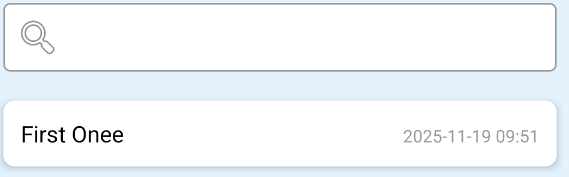
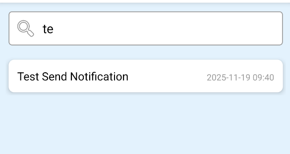
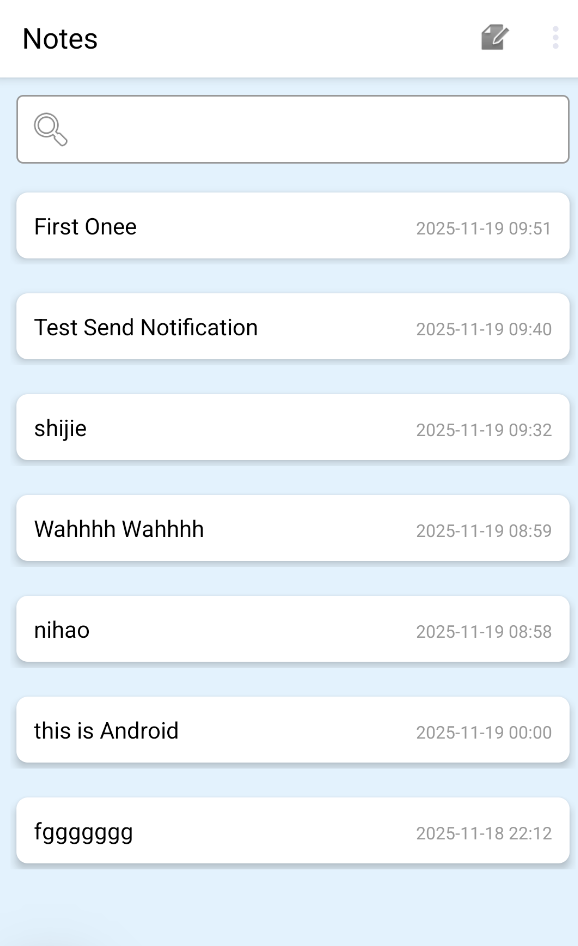
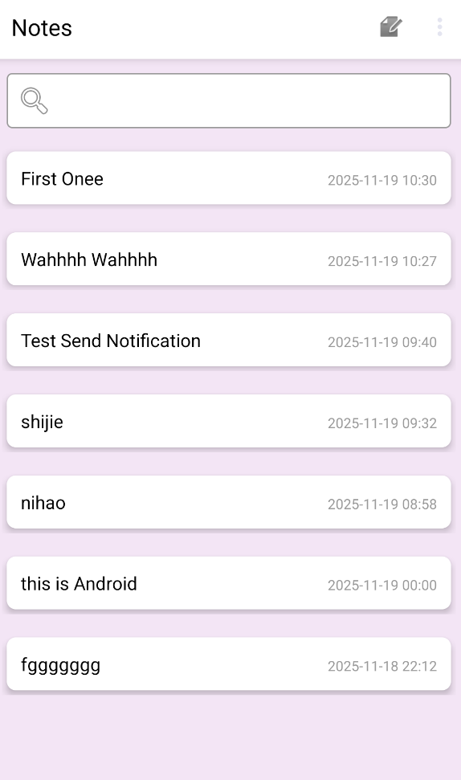
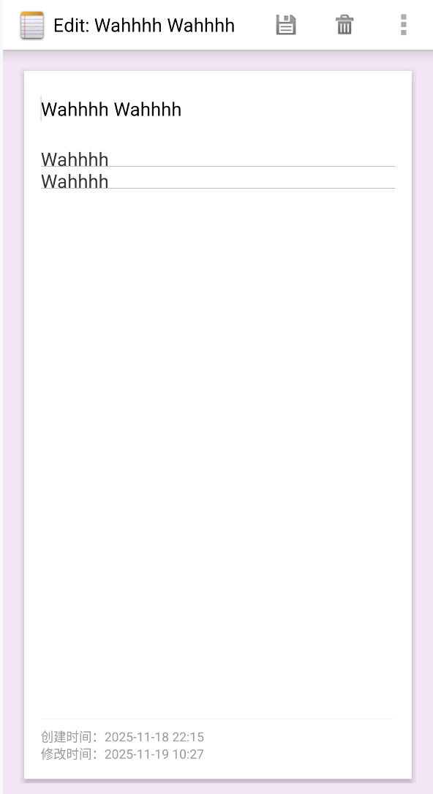
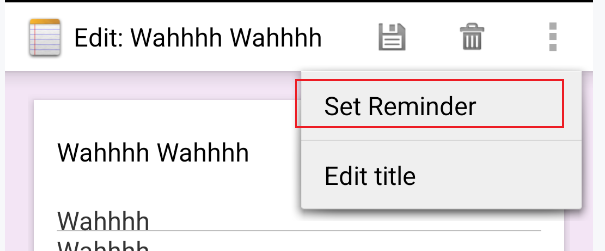
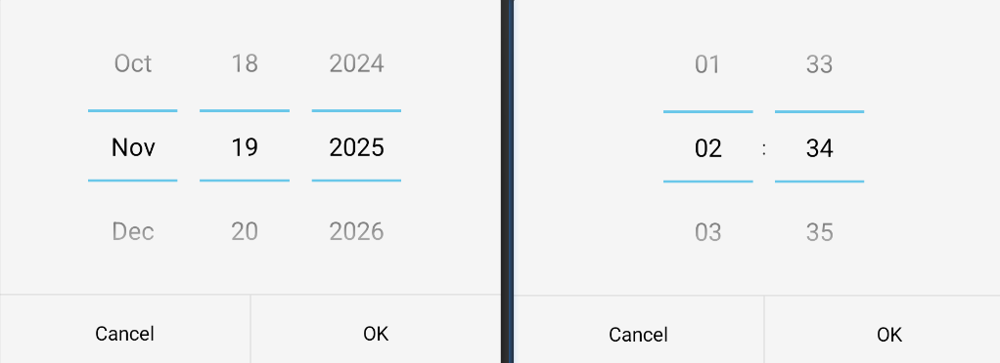
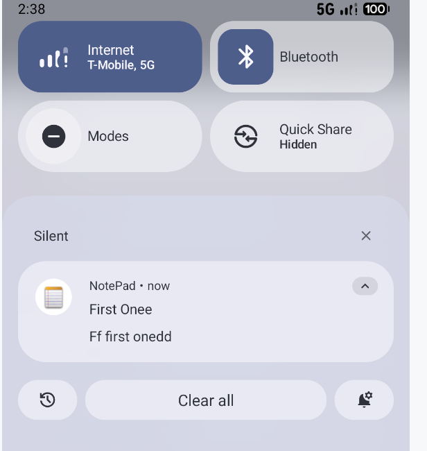

# NotePad

专业 __软件工程__   班级__4__  学号__121052023138__  姓名 __徐国梁__

实验日期：2025年 11月 19日

## 一、实验目的

1. 深入理解 Android 应用的架构设计，掌握 Activity、ContentProvider、SQLite 数据库等核心组件的协同工作机制。
2. 熟练运用 Android UI 开发技术，实现界面美化与交互优化，提升应用的用户体验。
3. 掌握 Android 数据存储与查询原理，实现笔记数据的高效检索功能。
4. 学习 Android 系统服务（如 AlarmManager、NotificationManager）的使用，实现定时提醒等扩展功能。
5. 培养独立分析现有项目源码、定位需求痛点并进行功能扩展的开发能力。

## 二、实验任务

基于 NotePad 记事本应用源码，完成以下功能开发与优化：

1. 基础功能：在 NoteList 界面的笔记条目上增加时间戳显示，直观展示笔记修改时间；添加笔记查询功能，支持根据笔记标题或内容进行模糊搜索
2. UI 美化：优化应用界面风格
3. 背景更换：支持背景颜色自定义更换，提升视觉体验。
4. 定时提醒：通过Notification发送通知，点击通知可直达对应笔记。

## 三、实验环境

Win11家庭版，Android Studio(2025.1.3)，Medium Phone模拟器

## 四、实验步骤

### （一）前期准备

1. 从指定仓库下载 NotePad 源码，导入 Android Studio 并完成项目构建，解决冲突与编译错误。
2. 分析源码结构，梳理核心组件关系：NoteList（列表页面）、NoteEditor（编辑页面）、NotePadProvider（数据提供者）、NotePad（数据契约类），明确数据流转逻辑。
3. 结合实验要求，按照优先级与难易程度划分开发顺序：时间戳显示->搜索->UI美化->背景色更换->定时通知

### （二）基础功能：添加笔记时间戳显示

1. 修改 NotesList.java 的 PROJECTION 数组，增加笔记修改时间列（COLUMN_NAME_MODIFICATION_DATE）的查询。
2. 自定义 CursorAdapter（CustomCursorAdapter），在 getView 方法中获取修改时间戳，通过 SimpleDateFormat 格式化（yyyy-MM-dd HH:mm），绑定到列表项的时间显示控件。
3. 调整 noteslist_item.xml 布局，优化时间控件的排版与样式（文字颜色、字号），确保与整体 UI 协调。

> 时间是修改时间，list也按照修改时间降序排序


**难点分析**：

个人感觉唯一有问题的，就是时间戳问题，我使用`System.currentTimeMillis()`打印的并不是中国上海时区，但是又感觉全局改很麻烦。最终决定的方案：不管如何存的，最后通过`setTimeZone(TimeZone.getTimeZone("Asia/Shanghai"))`统一转化为我国时区。

### （三）基础功能：实现笔记搜索功能

1. 在 notes_list.xml 布局中添加搜索输入框（EditText），配置搜索图标、提示文字与输入类型。
2. 为搜索框设置TextWatcher监听器，实时监听输入变化，触发搜索逻辑。
3. 实现performSearch ()方法：根据输入关键词构建查询条件（标题或内容包含关键词），通过ContentResolver查询数据库，返回筛选后的Cursor。
4. 更新适配器数据，实现搜索结果的实时刷新；处理搜索框为空时恢复显示全部笔记的逻辑。


* 搜索框为空时：

​		

* 有搜索内容时：




### （四）UI 美化

1. 在 res/values/colors.xml 中定义多种淡色系背景色（浅灰、浅蓝、浅绿等），适配不同用户偏好。
2. 在 list_options_menu.xml 中添加 “更换背景” 菜单项，绑定点击事件。
3. 实现背景选择对话框（AlertDialog），列出可选背景色供用户选择，通过 SharedPreferences 保存用户选择的背景色资源 ID。
4. 在 NotesList 和 NoteEditor 中添加 applyBackgroundSetting () 方法，读取保存的背景色配置，设置根布局背景，确保列表页与编辑页背景风格一致。


* 整体UI美化：

  * 标题栏美化

  * 使用阴影打造卡片效果让每个笔记Item悬浮
  * 极简界面与配色



* 编辑/新增页面UI美化：
  * 标题栏美化
  * 划分title和content区域
  * 底部单独显示创建时间和修改时间
  * 主题是卡牌样式


### （五）背景颜色自定义

1. 在res/values/colors.xml中定义多种淡色系背景色（浅灰、浅蓝、浅绿等），适配不同用户偏好。
2. 在list_options_menu.xml中添加 “更换背景” 菜单项，绑定点击事件。
3. 实现背景选择对话框（AlertDialog），列出可选背景色供用户选择，通过SharedPreferences保存用户选择的背景色资源 ID。
4. 在 NotesList 和 NoteEditor 中添加applyBackgroundSetting() 方法，读取保存的背景色配置，设置根布局背景，确保列表页与编辑页背景风格一致。


* 新增选择背景色菜单


* 点击出现预设的背景色


* 点击切换背景色为浅紫色（会同时影响到list页面和笔记编辑界面）





### （六）定时提醒功能

1. 新增`NotificationReceiver`广播接收器，重写onReceive方法，接收定时广播后构建通知（包含笔记标题、内容），设置点击通知跳转至笔记编辑页面的 PendingIntent。
2. 在editor_options_menu.xml中添加 “设置定时提醒” 菜单项，在NoteEditor.java中重写onOptionsItemSelected方法，绑定菜单点击事件。
3. 实现时间选择逻辑：通过DatePickerDialog+TimePickerDialog组合，让用户选择提醒日期与时间，获取选中的时间戳。
4. 实现setReminder ()方法：通过 AlarmManager 注册定时任务，传入包含笔记信息（标题、内容、URI）的Intent，设置精确触发时间，适配不同Android版本的API差异。
5. 在AndroidManifest.xml中注册广播接收器，添加必要权限（WAKE_LOCK、SET_ALARM）。


* 新增/编辑页面新增了设置提醒的菜单



* 设置年月日时分（此处两个合并展示，实际是分开的）



* 通知查看



### （七）功能测试与优化

1. 针对每个功能模块进行单元测试：验证时间戳显示准确性、搜索功能匹配精度、背景切换有效性、定时提醒触发成功率。
2. 优化 UI 交互细节：搜索框输入时隐藏软键盘、背景切换时实时刷新界面、定时提醒设置后显示成功提示。
3. 修复兼容性问题：适配低版本 Android 系统的 Notification 构建方式、Cursor 生命周期管理（避免内存泄漏）。

## 五、实验结果

### （一）功能实现效果

1. 时间戳显示：NoteList 界面的每个笔记条目右侧均显示格式化后的修改时间，用户可直观了解笔记更新情况。
2. 搜索功能：输入关键词后，列表实时筛选出标题或内容包含关键词的笔记，支持模糊匹配，无匹配结果时显示空列表。
3. 背景自定义：用户可通过菜单自由切换应用背景色，列表页与编辑页背景同步更新，界面风格统一且美观。
4. 定时提醒：设置提醒时间后，到达指定时间系统自动发送通知，点击通知可直接打开对应的笔记编辑页面，实现高效备忘。

### （二）关键代码示例

搜索功能核心代码：

```java
// 执行搜索逻辑
private void performSearch() {
    Cursor filteredCursor;

    if (TextUtils.isEmpty(mCurrentSearchQuery)) {
        // 使用普通查询代替 managedQuery
        filteredCursor = getContentResolver().query(
                getIntent().getData(),
                PROJECTION,
                null,
                null,
                NotePad.Notes.DEFAULT_SORT_ORDER
        );
    } else {
        // 构建搜索条件：标题或内容包含搜索关键词
        String selection = NotePad.Notes.COLUMN_NAME_TITLE + " LIKE ? OR "
                + NotePad.Notes.COLUMN_NAME_NOTE + " LIKE ?";
        String[] selectionArgs = new String[]{
                "%" + mCurrentSearchQuery + "%",
                "%" + mCurrentSearchQuery + "%"
        };

        // 使用普通查询代替 managedQuery
        filteredCursor = getContentResolver().query(
                getIntent().getData(),
                PROJECTION,
                selection,
                selectionArgs,
                NotePad.Notes.DEFAULT_SORT_ORDER
        );
    }

    // 更新适配器数据
    CustomCursorAdapter adapter = (CustomCursorAdapter) getListAdapter();
    if (adapter != null) {
        // 关闭旧游标后再设置新游标
        Cursor oldCursor = adapter.getCursor();
        adapter.changeCursor(filteredCursor);
        if (oldCursor != null && !oldCursor.isClosed()) {
            oldCursor.close();
        }
    }
}
```

背景色切换核心代码：

```java
// 更新背景
private void updateBackground() {
    SharedPreferences prefs = getSharedPreferences("NotePrefs", MODE_PRIVATE);
    int bgColor = prefs.getInt("bg_color", R.color.bg_light_gray);
    int colorValue = getResources().getColor(bgColor);

    // 1. 更新根布局背景
    View rootView = findViewById(android.R.id.content);
    rootView.setBackgroundColor(colorValue);

    // 2. 更新列表背景（保持透明，继承根布局）
    getListView().setBackgroundColor(Color.TRANSPARENT);

    // 3. 更新适配器中的列表项背景
    CustomCursorAdapter adapter = (CustomCursorAdapter) getListAdapter();
    if (adapter != null) {
        adapter.updateBackgroundColor(bgColor);
    }
}
```


定时提醒核心代码：

```java
/**
 * 设置定时提醒
 */
private void setReminder(long triggerTime) {
    // 获取当前笔记的标题和内容
    String title = mTitleText.getText().toString().trim();
    String content = mContentText.getText().toString().trim();
    if (TextUtils.isEmpty(title)) {
        title = getString(R.string.untitled_note); // 无标题时使用默认值
    }

    // 创建提醒意图（触发NotificationReceiver）
    Intent intent = new Intent(this, NotificationReceiver.class);
    intent.setAction(REMINDER_ACTION);
    intent.putExtra("title", title);
    intent.putExtra("content", content);
    intent.setData(mUri); // 传递笔记URI，点击通知可打开对应笔记

    // 创建PendingIntent
    PendingIntent pendingIntent = PendingIntent.getBroadcast(
            this,
            (int) System.currentTimeMillis(), // 用时间戳作为唯一标识
            intent,
            PendingIntent.FLAG_UPDATE_CURRENT | PendingIntent.FLAG_IMMUTABLE
    );

    // 使用AlarmManager设置定时任务
    AlarmManager alarmManager = (AlarmManager) getSystemService(Context.ALARM_SERVICE);
    if (alarmManager != null) {
        // 根据系统版本设置提醒（适配Android 12+）
        if (Build.VERSION.SDK_INT >= Build.VERSION_CODES.HONEYCOMB_MR1) {
            alarmManager.setExactAndAllowWhileIdle(
                    AlarmManager.RTC_WAKEUP,
                    triggerTime,
                    pendingIntent
            );
        } else {
            alarmManager.setExact(
                    AlarmManager.RTC_WAKEUP,
                    triggerTime,
                    pendingIntent
            );
        }
        Toast.makeText(this, "Reminder set successfully", Toast.LENGTH_SHORT).show();
    }
}
```

## 六、总结

1. AI时代确实大大降低了技术上手难度。我本身是Java开发方向的，我深有体会，版本兼容性一直是一个很麻烦的东西。原本仓库的、老师给的、我自己的，各有自己的版本，很多做法容易不兼容，需要做很多版本兼容性的处理，如果没有AI帮忙，要处理这些需要查询大量的资料才有可能能解决，但是有了AI，只需要给它看看gradle相关文件，很快就能解决。

2. 整体做下来感觉难度还行，熟悉了SQLite使用，也熟悉了如何基于现有项目增添新功能。
